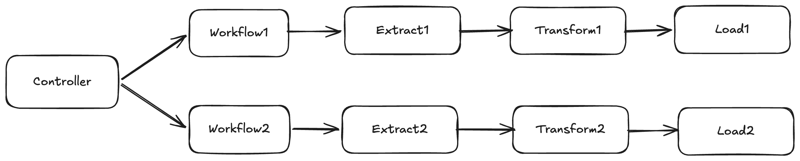

# Xango Spark Build

This repository now contains two separate Maven modules:

- `xango-spark-lib`: the reusable Spark workflow library that is published as a jar.
- `xango-spark-archetype`: the archetype that generates only application-specific implementation classes and imports the library through `pom.xml`.

## Architecture

The published library provides the controller, workflow orchestration, task traits, pipeline context, batching support, and processed-date logging. The generated project only contains `Main` and the workflow implementation classes that extend those library traits.



In the generated project, `Main` extends the library `Controller`, registers one or more workflows, and each workflow implementation owns the ETL-style sequence that processes the data end to end.

The library supports optional batch-based date processing. A pipeline can process a large date range in smaller windows such as 30-day batches, and it can persist completed processing dates to a log so reruns skip dates that already finished successfully.

Non-date pipelines can also skip batching entirely and run once end to end.

## Build The Modules

```bash
mvn clean install
```

## Publish Order

1. Publish `xango-spark-lib` to Maven Central.
2. Publish `xango-spark-archetype`.

The archetype is designed so generated projects depend on the published library jar instead of generating the framework code into each project.

## Generate a project from the archetype

```bash
mvn archetype:generate \
  -DarchetypeGroupId=io.github.pankaj8saikia \
  -DarchetypeArtifactId=xango-spark-archetype \
  -DarchetypeVersion=1.0-SNAPSHOT \
  -DgroupId=com.acme.data \
  -DartifactId=sample-spark-job \
  -Dversion=1.0.0-SNAPSHOT \
  -Dpackage=com.acme.data \
  -DxangoSparkLibraryGroupId=io.github.pankaj8saikia \
  -DxangoSparkLibraryArtifactId=xango-spark-lib \
  -DxangoSparkLibraryVersion=1.0-SNAPSHOT \
  -DinteractiveMode=false
```

## Optional generation properties

- `scalaBinaryVersion` defaults to `2.12`
- `scalaVersion` defaults to `2.12.18`
- `sparkVersion` defaults to `3.5.1`
- `mainClass` defaults to `${package}.Main`
- `xangoSparkLibraryGroupId` defaults to `io.github.pankaj8saikia`
- `xangoSparkLibraryArtifactId` defaults to `xango-spark-lib`
- `xangoSparkLibraryVersion` defaults to `1.0-SNAPSHOT`
